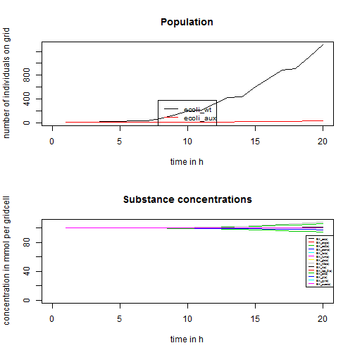
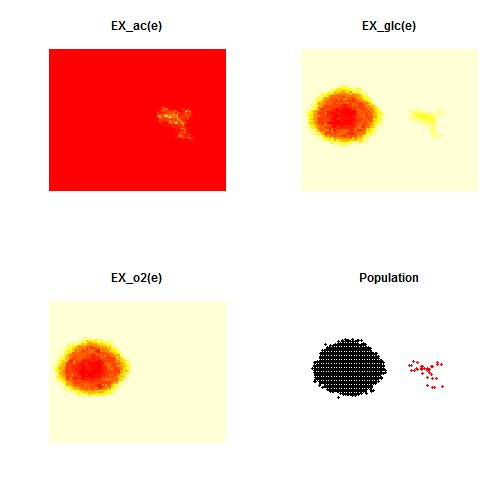
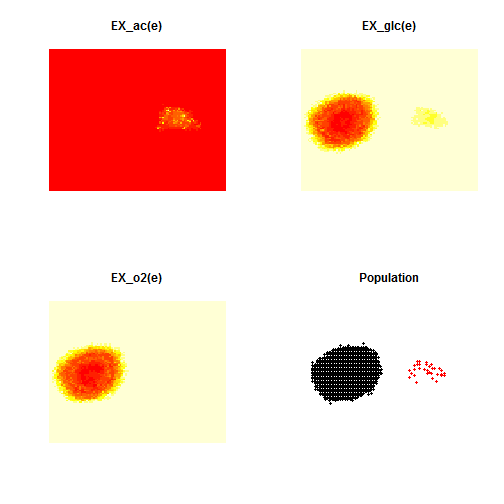
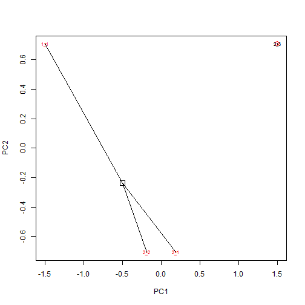

Microbial communities are essential for global ecosystems and human health. Computational modeling of microbial consortia is thus a major goal in systems biology and microbial ecology. BacArena is a project to simulate bacterial behaviour in communities. A lot of progress is done in the last years to gain genome wide metabolic reconstructions of certain organisms, which open a wide field of mathematical analysis. One of this new methods is  fux balanced analysis (fba) to estimate optimal metabolic  fluxes under certain constraints. With this work, advanced models are build which are available in an exchangeable format (SBML). Some of these models can be found in http://bigg.ucsd.edu/. The idea of this project is to use this existing reconstructions and put them in a spatial and temporal environment to study their possible interactions. This is achieved by the combination of agent based modeling with fba. Each bacterium is considered as an agent with individual states, own properties and rules to act. Agents are located on a grid where they can move and interact via metabolic exchanges computed by fba. The starting point for our project is curiosity of what could be done with this huge models. We just throw those models into an arena to see what kind of actions will evolve.

## Installing

BacArena is avaible as a R package. The developmental version can be installed from GitHub with the devtools package:

```r
library("devtools")
```

```
## Warning: package 'devtools' was built under R version 3.1.2
```

```r
install_github("euba/BacArena", ref="rpkg")
```

```
## Downloading github repo euba/BacArena@rpkg
## Installing BacArena
## "C:/PROGRA~1/R/R-31~1.0/bin/x64/R" --vanilla CMD INSTALL  \
##   "C:/Users/eugen.bauer/AppData/Local/Temp/Rtmp6FPfdi/devtools226867d76442/euba-BacArena-4cedbac"  \
##   --library="C:/Users/eugen.bauer/Documents/R/win-library/3.1"  \
##   --install-tests
```

## Getting started

First we have to load the installed package in the workspace with


```r
library("BacArena")
```

```
## Loading required package: sybil
## Loading required package: Matrix
## Loading required package: lattice
## Loading required package: RcppArmadillo
```

```
## Warning: package 'RcppArmadillo' was built under R version 3.1.2
```

```
## Loading required package: glpkAPI
## using GLPK version 4.47
```

Next we set-up the *Escherichia coli* core metabolic model


```r
ecore <- model
```

The model is integrated in BacArena by default. Alternatively you can also load your own model of interest with commands of the sybil package and libSBML. After we loaded the model, we convert it into an object of class Bac by calling the constructor


```r
bac <- Bac(ecore,deathrate=0.1,duplirate=1,
           growthlimit=0.05,growtype="exponential")
```

Now we have to set up an environment in which the organisms can interact


```r
arena <- Arena(100,100)
```

Here, we chose 100 times 100 as the grid size of the environment. Next we want to put our created organism in its environment by


```r
addOrg(arena,bac,amount=1,x=50,y=50)
```

With this command we added one individual of our bacterium in the middle of the environment (by its x and y position). Next we can add the substances to the environment


```r
addSubs(arena,40)
```

Now we added all possible substances to the environment arena with a concentration 40 mmol per gridcell. Finally we can start the simulation with


```r
eval <- simEnv(arena,20)
```

```
## iter: 1 Organisms: 1 
## iter: 2 Organisms: 2 
## iter: 3 Organisms: 4 
## iter: 4 Organisms: 8 
## iter: 5 Organisms: 16 
## iter: 6 Organisms: 16 
## iter: 7 Organisms: 32 
## iter: 8 Organisms: 32 
## iter: 9 Organisms: 64 
## iter: 10 Organisms: 123 
## iter: 11 Organisms: 193 
## iter: 12 Organisms: 202 
## iter: 13 Organisms: 308 
## iter: 14 Organisms: 411 
## iter: 15 Organisms: 428 
## iter: 16 Organisms: 581 
## iter: 17 Organisms: 723 
## iter: 18 Organisms: 856 
## iter: 19 Organisms: 913 
## iter: 20 Organisms: 1125
```

The object eval stores all 20 simulation steps, that we performed. After we retrieve the eval object we can plot now the results of the simulation


```r
plotCurves(eval)
```

 

This will plot the growth curve and curves of substance concentration changes over the 20 simulation steps. If we are interested in the spatial and temporal changes of our constructed population we can use 


```r
evalArena(eval,sims=c(1,20))
```

  

This will produce multiple plots one by one for each simulation step with the spatial structure of the population (black dots represent individuals). We can also investigate the spatial change of the population together with the main subtrate glucose


```r
evalArena(eval,c("population","EX_glc(e)"),sims=c(1,20))
```

  

Here we only plot the first and the last result of the simulation steps given by the parameter sims. At the same time we can also integrate the visualization of different phenotypes into the population 


```r
evalArena(eval,c("population","EX_glc(e)"),phencol=T,sims=c(1,20))
```

  

Now we can see that the periphery of the population has a different color than the individuals in the center. This indicates that individuals on the outside of the population use a different metabolism (respiration of glucose) than the center (fermentation of glucose and acetate). To visualize the differences of the apparent phenotypes we can use


```r
minePheno(eval)
```

 

This will create a PCA plot with the similarity of the different phenotypes. If we are interested in the definition of the phenotypes we can retreive the original phenotype matrix with


```r
pmat <- getPhenoMat(eval)
```

The object pmat carries now the different phenotypes which are defined by used exchange reactions within individuals on the population. A value of 1 means secretion, 2 means uptake and 0 means no usage of the substance of interest.

## Advanced

Now we want to multiple organisms or organism types in the environment. For this we create two different types of the *Escherichia coli* core metabolic model: A wildtype *E. coli* and an auxotrophic mutant which is unable to use aerobic respiration.


```r
ecore <- model
bac1 <- Bac(ecore,deathrate=0.1,duplirate=1,type="ecoli_wt",
           growthlimit=0.05,growtype="exponential")

## now creating the auxotrophic mutant by using sybil commands.
ecore_aux <- changeBounds(ecore,"EX_o2(e)",lb=0)
bac2 <- Bac(ecore_aux,deathrate=0.1,duplirate=1,type="ecoli_aux",
           growthlimit=0.05,growtype="exponential")
```

Again we set up a environment and insert organisms and substances


```r
arena <- Arena(100,100)
addOrg(arena,bac1,amount=1,x=25,y=50)
addOrg(arena,bac2,amount=1,x=75,y=50)
addSubs(arena,160)
eval <- simEnv(arena,20)
```

```
## iter: 1 Organisms: 2 
## iter: 2 Organisms: 4 
## iter: 3 Organisms: 6 
## iter: 4 Organisms: 10 
## iter: 5 Organisms: 18 
## iter: 6 Organisms: 20 
## iter: 7 Organisms: 36 
## iter: 8 Organisms: 36 
## iter: 9 Organisms: 68 
## iter: 10 Organisms: 131 
## iter: 11 Organisms: 204 
## iter: 12 Organisms: 210 
## iter: 13 Organisms: 320 
## iter: 14 Organisms: 432 
## iter: 15 Organisms: 450 
## iter: 16 Organisms: 609 
## iter: 17 Organisms: 753 
## iter: 18 Organisms: 903 
## iter: 19 Organisms: 926 
## iter: 20 Organisms: 1169
```

Here we put the both organism types we created next to each other (given by their x position) in the environment and then started the simulation for 20 time steps. Next we perform again all evaluation steps


```r
plotCurves(eval)
```

 

And the spatial pattern of the community with the substances glucose, acetate and oxygen:


```r
evalArena(eval,c("population","EX_glc(e)","EX_ac(e)","EX_o2(e)"),
          sims=c(1,20))
```

  

Here different point colors indicate the two different organism types. Finally also the different phenotypes:


```r
minePheno(eval)
```

 

```r
print(getPhenoMat(eval))
```

```
##           EX_ac(e) EX_akg(e) EX_co2(e) EX_etoh(e) EX_for(e) EX_fum(e)
## ecoli_wt         0         0         1          0         0         0
## ecoli_aux        1         0         2          1         1         0
##           EX_glc(e) EX_h2o(e) EX_h(e) EX_lac_D(e) EX_o2(e) EX_pi(e)
## ecoli_wt          2         1       1           0        2        2
## ecoli_aux         2         2       1           0        0        2
##           EX_pyr(e) EX_succ(e)
## ecoli_wt          0          0
## ecoli_aux         0          0
```

Based on the results we can see, that the auxotrophic organism type grows slower in general and uses just fermentation of glucose, whereas the the wildtype can respire glucose with the aid of oxygen. We can also create customized microbial communities or multicellular systems by importing external SBML models using the readSBMLmod function in the sybilSBML package. 
